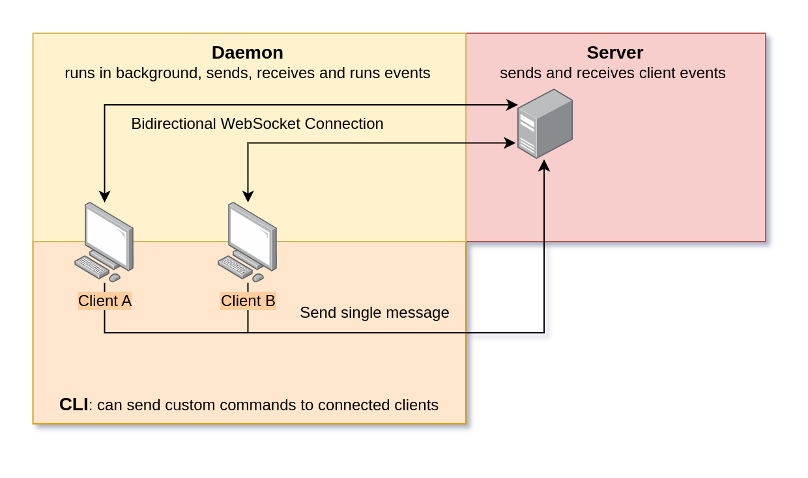

# Mysti
Mysti is a cross-platform event synchronization software. It can be used to sync clipboard events between different devices, turn computers on and off via the network and other features.

Current features:
- Copy text and images between different computers (e.g. copy between a Windows PC and Linux Laptop)
- Turn on a computer via Wake on LAN (if on the same network as your server and configured correctly)
- Turn off, log off or reboot a computer remotely

### Overview
Mysti has three components:
- A **server** that clients can connect to for exchanging events
- A **daemon** that runs in the background on client PCs to process events (runs commands and sends clipboard changes to the server)
- A **CLI** that can be used to send commands interactively



<details>

<summary>Instruction for building from source</summary>

### Build from source
This section describes how to build the software from source.

You can build both the server, daemon and CLI from source using `cargo build` in their directories (or `make` in the main directory to install CLI/Daemon).

For the daemon, you might need to install additional libraries, which you can find listed in [the CI config file](.github/workflows/build-client.yml).

### Server
The server is built in Docker. Feel free to contribute additional common configurations.

</details>


## Server Setup
Before using the daemon/CLI, you need to have a working server setup. You need to install Docker on your system to run the server.

For your setup, you can copy one of the directories in the [deployment](deployment) directory.

```shell
deployment/arm64v8-namecheap$ tree -aA
.
├── Caddyfile
├── config.toml
├── docker-compose.yml
├── Dockerfile
├── Dockerfile.caddy
└── .env

1 directory, 6 files
```

First of all, make sure to edit the Caddyfile to add your own E-Mail and other host information. You might need to edit the `Dockerfile.caddy` to add custom Caddy modules to support your DNS provider.

Then make sure to edit `config.toml` with the actual settings of the Mysti server:

```toml
# the HTTP port the server should listen on
web_port = 43853

# a custom token to use for authentication - you can e.g. generate one with
#    xxd -l 30 -p /dev/urandom
token = "your custom token to use as password"

[wake_on_lan]
# The target address is the MAC address of the PC you want to wake up.
# The mysti server must be on the same network as the PC.
target_addr = "AA:AA:AA:AA:AA:AA"
router_addr = "255.255.255.255"
```

Once all the information has been added, you can build your setup:

	docker compose build --pull

Make sure the correct ports are exposed and then try running the daemon.

## Daemon and CLI Setup
The daemon should run in the background of your devices and connect to the server, syncing events (like clipboard changes) as they happen. It is available for many Windows and Linux-based operating systems. The CLI is an additional helper for sending remote commands to other connected clients.

First of all, you can download the daemon and CLI binaries for your client(s) from [the latest release here on GitHub](http://github.com/xarantolus/mysti/releases/latest). For Windows, you would download and unzip `mysti-windows.zip`. Then you can unzip it into a directory that is available on your `$PATH`. The same goes for Linux.

### Configuration
First of all, we need to tell the daemon which server to connect to. You can do this by creating a configuration file with [this content](deployment/daemon/daemon-config.toml):

```toml
# This is the mysti daemon configuration file.
# Depending on the operation system, it is expected in the following locations:
#   Linux/Mac: $XDG_CONFIG_HOME/mysti.toml, $HOME/.config/mysti.toml or working directory
#   Windows: %USERPROFILE%\.config\mysti.toml or working directory

# The daemon connects to the server specified
# If you use Caddy or some other reverse proxy,
# make sure to specify the correct port (the output port of Caddy)
server_host = "https://my.host.com:1234"

# The token is used to authenticate the client with the server.
# When you set up the server, you should have generated a token
# that is also specified in the servers' configuration file.
token = "my cool token"
```

It is recommended to put the configuration file into `~/.config/mysti.toml` on both Linux and `%USERPROFILE%\.config\mysti.toml` on Windows (you might have to create the `.config` directory yourself). That way, both the CLI and daemon can find the same configuration file.

### Automatically start the daemon on boot
This section shows how to set up the daemon to start on user login. This is sadly very different between operating systems, so make sure to look for additional guides for your specific setup.

### Windows
First of all, create a directory where you unzip `mysti.exe` and `mysti-daemon.exe`. Add that directory to the `PATH` environment variable.

Since we want to start the daemon without a console window visible, we need to create a wrapper script that starts the daemon. Create `mysti.vbs` with the following content:

```vbs
Set objShell = CreateObject("WScript.Shell")
objShell.Run "mysti-daemon", 0
Set objShell = Nothing
```

Then you can add a shortcut to `mysti.vbs` to your startup folder (open it with `Win+R` and `shell:startup`). Now when you start your machine, the script will be run, which runs the daemon.

### Fedora Linux (39)
To create an autostart entry, edit the autostart file:

```
nano ~/.config/autostart/mysti-daemon.desktop
```

Paste in the following content and save the file:

```desktop
[Desktop Entry]
Name=Mysti daemon
Exec=mysti-daemon
Type=Application
```

Now upon a reboot, the daemon should run in the background. Check using `pidof mysti-daemon-fedora`

### Limitations
- On Linux, clipboard sync support depends on your setup (X11 vs. Wayland). In theory all options are supported, but I can't really test it. On my Fedora 39 machine with Wayland (and `Xwayland`), clipboard events works
- Some image copy operations might not be synced. However, the daemon tries its best to convert between different formats and uses a common format to sync between all platforms
